Sketch Plugins Cookbook
=======================

A collection of recipes for Sketch App plugins developers.

I will be posting daily updates in my twitter. Follow me [@turbobabr](https://twitter.com/turbobabr) to stay tuned.

## CocoaScript: Don't use '===' operator

At first glance CocoaScript seems to be a just fancy name for JavaScript with some syntactic sugar, but in reality many things work differently and it's better to know them.

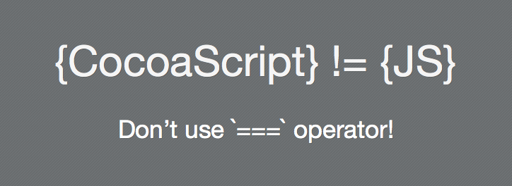

One of the caveats are `===` and `!==` operators best known as `strict equality` and `strict not equal`. The very brief suggestion about them is:
- **AVOID USING THEM AT ANY COST IN SKETCH PLUGINS!**

To understand the problem, try to run the following script:
```JavaScript
var strA = "hello!";
var strB = @"hello!";

if(strA == strB) {
    print("They are EQUAL!");
} else {
    print("NOT EQUAL!")
}
// -> "They are EQUAL!"

if(strA === strB) {
    print("They are EQUAL!");
} else {
    print("NOT EQUAL!")
}
// -> "NOT EQUAL!"
```

It will produce `true` for `==` operator and `false` for `===`. The string values are equal, both are assigned with `"hello!"` string but their types are different. Now run this script to check their types:
```JavaScript
function typeOf(obj) {
    print(toString.call(obj));
}

var strA = "hello!";
var strB = @"hello!";

typeOf(strA);
// -> [object String]

typeOf(strB);
// -> [object MOBoxedObject]
```

As you can see, variables `strA` & `strB` are of different types. `strA` is a JavaScript string, but `strB` is a mysterious `MOBoxedObject`. The problem is in definition of `strB` - `@"hello!"` is equal to `NSString.stringWithString("hello!")` and it produces boxed instance of NSString class instead of JS string.

When developing Sketch plugins, you usually deal with the data that is produced on `Sketch Runtime` side. And most of the property getters and class methods return boxed Objective-C objects instead of native JS objects.

To demonstrate a real world problem you can easily encounter with: (1) Create a rectangle shape, (2) Select it, (3) Run the following script:
```JavaScript
var layer=selection.firstObject();
if(layer) {
    print(layer.name());
    // -> Rectangle 1

    var isNameEqual = layer.name() === "Rectangle 1";
    print(isNameEqual);
    // -> false
}
```

> Note: The usage of `===` and `!==` isn't forbidden, you can use them whenever you want to, but always pay attention to types of variables you compare. It's especially important when you try to port an existing JavaScript library or framework to CocoaScript. But anyway, I insist to forget strict equal/not equal operators and use '==' and '!=' + manual type check if needed.

## Playing Sounds

Usually sounds bound to commands are annoying and useless, but sometimes they are very helpful when used with care.


Since Sketch plugins have access to all the APIs of [AppKit Framework](https://developer.apple.com/documentation/appkit?language=objc), we are able to do really crazy & cool things with plugins.. for example play a `beep!` sound when plugin shows an error message using `-MSDocument.showMessage:` method to make the message more noticeable to a user.

Here is how we can play `beep` sound to indicate some sort of error:
```JavaScript
context.document.showMessage("Hey! We have a problem!")
NSBeep()
```

To play a custom audio file we can use a simple interface of [NSSound](https://developer.apple.com/documentation/appkit/nssound?language=objc) class. Here is the sample code how to use it:
```JavaScript
var filePath = "/System/Library/Sounds/Pop.aiff"

var sound = NSSound.alloc().initWithContentsOfFile_byReference(filePath,true);
sound.play();
```


Alternatively, you can play any system sound using a handy [+NSSound.soundNamed:](https://developer.apple.com/documentation/appkit/nssound/1477318-soundnamed?language=objc) class method:
```JavaScript
const SystemSounds = {
  Basso: "Basso",
  Blow: "Blow",
  Bottle: "Bottle",
  Frog: "Frog",
  Funk: "Funk",
  Glass: "Glass",
  Hero: "Hero",
  Morse: "Morse",
  Ping: "Ping",
  Pop: "Pop",
  Purr: "Purr",
  Sosumi: "Sosumi",
  Submarine: "Submarine",
  Tink: "Tink"
};

var sound = NSSound.soundNamed(SystemSounds.Glass)
sound.play()
```

## Centering Rectangle on Canvas

To center canvas on a certain point or region, you can use a handy `-(void)MSContentDrawView.centerRect:(CGRect)rect animated:(BOOL)animated` instance method, where `rect` is a rectangle to be centered, `animated` is a flag that turns on/off animation during the scrolling process.

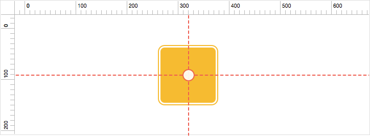

The origin and size of the rectangle you provide to this method should be in absolute coordinates.

The following example centers viewport by `x:200,y:200` point:
```JavaScript
var canvasView = context.document.currentView(); // Getting canvas view
canvasView.centerRect_animated(CGRectMake(200,200,1,1),true);
```
The example below shows how to center a first selected layer using the same method:
```JavaScript
var layer = context.selection.firstObject()
if(layer) {
    var view = context.document.currentView();
    view.centerRect_animated(layer.absoluteRect().rect(),true);
}
```

## Creating Custom Shape

To create a custom vector shape programmatically, you have to create an instance of [NSBezierPath](https://developer.apple.com/documentation/appkit/nsbezierpath?language=objc) class and draw whatever shape or combination of shapes you want to. Then create a shape group from it using `+(MSShapeGroup*)MSShapeGroup.shapeWithBezierPath:(NSBezierPath*)path` class method.

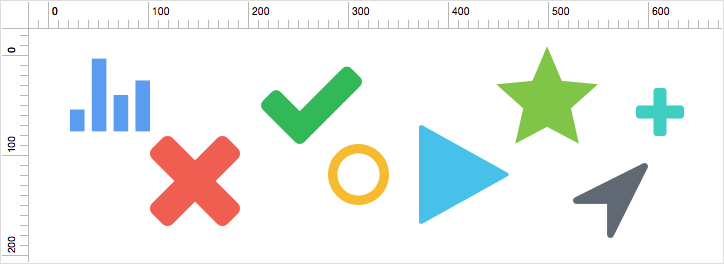

This technique is very similar to creation of custom paths described in previous recipe. The only difference is that you have to close the path before converting it to the shape group.

The following example create a simple arrow shape:
```JavaScript
// All coordinates are provided in pixels
var path = NSBezierPath.bezierPath();
path.moveToPoint(NSMakePoint(10,10));
path.lineToPoint(NSMakePoint(100,10));
path.lineToPoint(NSMakePoint(100,0));
path.lineToPoint(NSMakePoint(120,15));
path.lineToPoint(NSMakePoint(100,30));
path.lineToPoint(NSMakePoint(100,20));
path.lineToPoint(NSMakePoint(10,20));
path.closePath();

var shape = MSShapeGroup.shapeWithBezierPath(path);
var fill = shape.style().addStylePartOfType(0); // `0` constant indicates that we need a `fill` part to be created
fill.color = MSColor.colorWithRGBADictionary({r: 0.8, g: 0.1, b: 0.1, a: 1});

var documentData = context.document.documentData();
var currentParentGroup = documentData.currentPage().currentArtboard() || documentData.currentPage()
currentParentGroup.addLayers([shape]);
```

## Create Line Shape

In order to create a line shape programmatically, you have to create an instance of [NSBezierPath](https://developer.apple.com/documentation/appkit/nsbezierpath?language=objc) class and add two points to it. Then create a shape group from it using `+(MSShapeGroup*)MSShapeGroup.shapeWithBezierPath:(NSBezierPath*)path` class method.

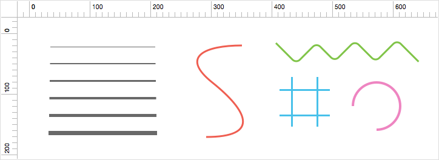

To make Sketch recognize the provided path as a line shape, you have to add only two points using `moveToPoint` & `lineToPoint` methods of `NSBezierPath`.

The following example creates a simple line shape with two points:
```JavaScript
var path = NSBezierPath.bezierPath();
path.moveToPoint(NSMakePoint(10,10));
path.lineToPoint(NSMakePoint(200,200));

var shape = MSShapeGroup.shapeWithBezierPath(path);
var border = shape.style().addStylePartOfType(1);
border.color = MSColor.colorWithRGBADictionary({r: 0.8, g: 0.1, b: 0.1, a: 1});
border.thickness = 3;

context.document.currentPage().addLayers([shape]);
```

The same way, you can easily create a multi segment line using methods provided by [NSBezierPath](https://developer.apple.com/documentation/appkit/nsbezierpath?language=objc) class. Whenever you add more than two points into the path, Sketch treats such shape as a vector path similar to what can be created using standard `V - Vector` tool.

The following example demonstrates how to create a curved path with four points:
```JavaScript
var path = NSBezierPath.bezierPath();
path.moveToPoint(NSMakePoint(84.5,161));
[path curveToPoint:NSMakePoint(166,79.5) controlPoint1:NSMakePoint(129.5,161) controlPoint2:NSMakePoint(166,124.5)];
[path curveToPoint:NSMakePoint(84.5,-2) controlPoint1:NSMakePoint(166,34.5) controlPoint2:NSMakePoint(129.5,-2)];
[path curveToPoint:NSMakePoint(3,79.5) controlPoint1:NSMakePoint(39.5,-2) controlPoint2:NSMakePoint(3,34.5)];

var shape = MSShapeGroup.shapeWithBezierPath(path);
var border = shape.style().addStylePartOfType(1);
border.color = MSColor.colorWithRGBADictionary({r: 0.8, g: 0.1, b: 0.1, a: 1});
border.thickness = 2;

context.document.currentPage().addLayers([shape]);
```

## Setting Border Radius for Specific Corners

Starting from version 3.2 Sketch allows to set custom border radius for specific corner of rectangle shape. It was possible prior to 3.2, but there was no direct API.

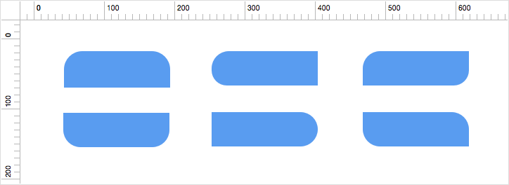

In order to set custom radiuses you use `-MSRectangleShape.setCornerRadiusFromComponents:(NSString*)compoents` instance method, where `components` is a string that represents radius values for every corner separated by `;` character. The sequence is following: `top-left/top-right/bottom-right/bottom-left`.

The following sample sets left-top and right-top corners of a selected rect shape to 15 points:
```JavaScript
var layer = context.selection.firstObject();
if(layer && layer.isKindOfClass(MSShapeGroup)) {
    var shape=layer.layers().firstObject();
    if(shape && shape.isKindOfClass(MSRectangleShape)) {
        shape.setCornerRadiusFromComponents("15;15;0;20");
    }
}
```

## Scaling Layers

You can scale any layer using `-MSLayer.multiplyBy:(double)scaleFactor` instance method, where `scaleFactor` is a floating-point value that is used to multiple all the layers' properties including position, size, and all the style attributes such as border thickness, shadow, etc. Here are some example scale factors: `1.0 = 100%`, `2.5 = 250%`, `0.5 = 50%`, etc.

This method produces the same result as a standard [Scale](http://bohemiancoding.com/sketch/support/documentation/03-layer-basics/4-resizing-layers.html) tool. Since all the layer type classes are inherited from `MSLayer` class, you can use this method to scale any type of layer including Pages and Artboards.

> Note: After the call of the method, `x` and `y` position values will also be multiplied. If you need the layer to remain in the same position after scaling, you'll have to change its position to the appropriate values.

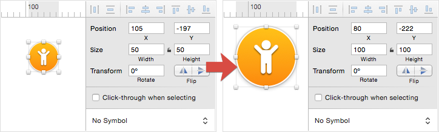


The following sample demonstrates how to scale first selected layer:
```JavaScript
var layer = context.selection.firstObject()
if(layer) {
    // Preserve layer center point.
    var midX=layer.frame().midX();
    var midY=layer.frame().midY();

    // Scale layer by 200%
    layer.multiplyBy(2.0);

    // Translate frame to the original center point.
    layer.frame().midX = midX;
    layer.frame().midY = midY;
}
```

## Finding Bounds For a Set of Layers

If you want to quickly find a bounding rectangle for selected layers or any set of layers, there is a very handy class method for that `+(CGRect)MSLayerGroup.groupBoundsForContainer:(MSLayerArray*)container`. It accepts an instance of `MSLayerArray` class, that represents a list of layers.

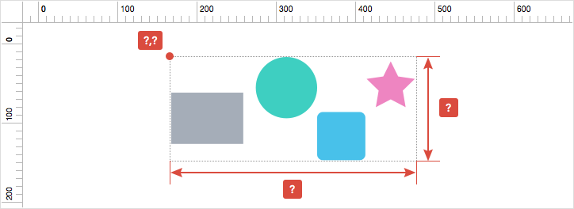

A quick sample that demonstrate how to use it:
```JavaScript
var selection = context.selection;
var bounds= MSLayerGroup.groupBoundsForContainer(MSLayerArray.arrayWithLayers(selection));

print("x: "+bounds.origin.x);
print("y: "+bounds.origin.y);
print("width: "+bounds.size.width);
print("height: "+bounds.size.height);
```

## Create Oval Shape

In order to create an oval shape programmatically, you have to create an instance of `MSOvalShape` class, set its frame and wrap with `MSShapeGroup` container.

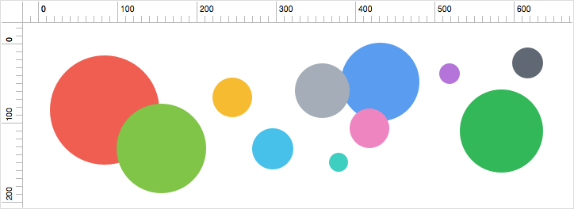

The following sample demonstrates how to do it:
```JavaScript
var ovalShape = MSOvalShape.alloc().init();
ovalShape.frame = MSRect.rectWithRect(NSMakeRect(0,0,100,100));

var shapeGroup=MSShapeGroup.shapeWithPath(ovalShape);
var fill = shapeGroup.style().addStylePartOfType(0);
fill.color = MSColor.colorWithRGBADictionary({r: 0.8, g: 0.1, b: 0.1, a: 1});

context.document.currentPage().addLayers([shapeGroup]);
```

## Create Shared Style Programmatically

In order to create a shared style programmatically you use `-MSSharedLayerStyleContainer.addSharedStyleWithName:(NSString*)name firstInstance:(MSStyle*)style` method, where `name` is a name of shared style being created, `style` is a reference style used as a template for future shared style.

You can create a shared style from the existing style that is bound to some layer or create it from scratch with a custom `MSStyle` instance.


Create shared style from selected layers' style:
```JavaScript
var selection = context.selection;
var doc = context.document;
var layer=selection.firstObject();
if(layer) {
    var sharedStyles=doc.documentData().layerStyles();
    sharedStyles.addSharedStyleWithName_firstInstance("Custom Style",layer.style());
}
```

Create shared style from scratch:
```JavaScript
var doc = context.document;
var sharedStyles=doc.documentData().layerStyles();

var style=MSStyle.alloc().init();
var fill=style.fills().addNewStylePart();
fill.color = MSColor.colorWithSVGString("#B1C151");

sharedStyles.addSharedStyleWithName_firstInstance("Custom Style 2",style);

doc.reloadInspector();
```

## Missing 'MSColor.colorWithHex:alpha:'? :)

Prior to Sketch 3.2 there was a really nice and handy class method called `MSColor.colorWithHex:alpha:` that allowed to create instance of `MSColor` class with hex string, but unfortunately with the release of Sketch 3.2 version it was removed from the API.

Good news everyone! The replacement for this method does exist:
```JavaScript
// Create color without alpha.
var color = MSColor.colorWithSVGString("#FF0000");
print(color);
// -> (r:1.000000 g:0.000000 b:0.000000 a:1.000000)

// Create color with alpha.
var color = MSColor.colorWithSVGString("#FF0000");
color.alpha = 0.2;
print(color);
// -> (r:1.000000 g:0.000000 b:0.000000 a:0.200000)
```

## Flatten Vector Layer

If you want to flatten a complex vector layer that contains several sub paths combined using different boolean operations into single layer, you can use `+MSShapeGroup.flatten` method.

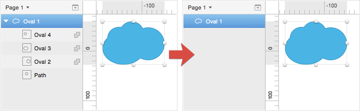

This sample code flattens a first selected vector layer:
```JavaScript
var selection = context.selection;
var layer=selection.firstObject();
if(layer && layer.isKindOfClass(MSShapeGroup)) {
    layer.flatten();
}
```

## Flatten Layers to Bitmap

### Note: This example currently doesn't work in Sketch 3.3 

In order to flatten one or several layers of any type to a single `MSBitmapLayer`, use `-MSLayerFlattener.flattenLayers:` method. It accepts one arguments which is an array of layers to be flattened.

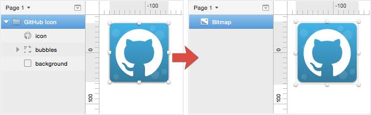

The following example flattens all the selected layers to a bitmap layer:
```JavaScript
var flattener = MSLayerFlattener.alloc().init();
flattener.flattenLayers(selection);
```

## Convert Text Layer to Outlines

In order to convert an existing `MSTextLayer` to `MSShapeGroup` layer, you have to get texts' `NSBezierPath` representation and then convert it to a `MSShapeGroup` layer.

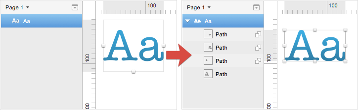

The following source code demonstrates how to get text layers' vector outline and use it to create a vector shape from it:
```JavaScript
function convertToOutlines(layer) {
    if(!layer.isKindOfClass(MSTextLayer)) return;

    var parent=layer.parentGroup();
    var shape=MSShapeGroup.shapeWithBezierPath(layer.bezierPathWithTransforms());

    shape.style = layer.style();
    var style=shape.style();
    if(!style.fill()) {
        var fill=style.fills().addNewStylePart();
        fill.color = MSColor.colorWithNSColor(layer.style().textStyle().attributes().NSColor);
    }

    var isSelected=layer.isSelected();
    shape.name = layer.name();
    shape.setIsSelected(isSelected);

    parent.removeLayer(layer);
    parent.addLayers([shape]);

    return shape;
}

var selection = context.selection;
var layer=selection.firstObject();
if(layer) {
    var vectorizedTextLayer=convertToOutlines(layer);
    print(vectorizedTextLayer);
}
```

## Get Points Coords Along the Shape Path

If you want to distribute some shapes along a path there is a convenient method `-pointOnPathAtLength:` implemented in `NSBezierPath_Slopes` class extension.

This method accepts a `double` value that represents a position on path at which you want to get a point coordinate. It returns a `CGPoint` struct with coordinates of the point.

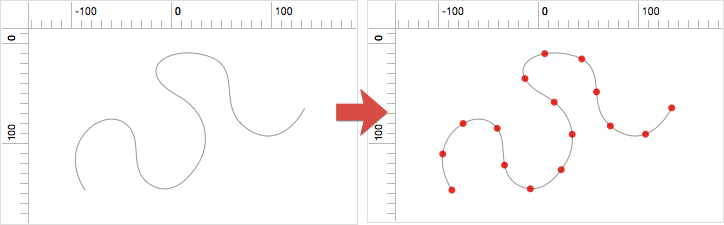

The following example divides shape path into 15 segments and prints out their points coordinates:
```JavaScript
var selection = context.selection;
var layer=selection.firstObject();
if(layer && layer.isKindOfClass(MSShapeGroup)) {

    var count=15;
    var path=layer.bezierPathWithTransforms();

    var step=path.length()/count;
    for(var i=0;i<=count;i++) {
        var point=path.pointOnPathAtLength(step*i);
        print(point);
    }
}
```